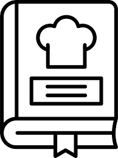

# API: Receitas Favoritas

API desenvolvida para guardar suas receitas e poder consultar quando precisar através de filtros

Se você sempre vê uma receita e pensa que deveria salvar ela para fazer depois,
acredite, está no lugar certo. Através do Endpoint de criar uma receita, você vai poder criar, editar, excluir ou consultar uma receita pela tag dela…
Gostaria de salvar receita com imagem? Sem problemas, salva uma receita e depois acrescente uma imagem nela através do endpoint que fornece essa função.

Fique tranquilo aqui no nosso sistema você não ser a "vergonha da profisoon"...

Não é uma pegadinha nosso sistema esta devidamente testado para você.

 

## 🛠️ Funcionalidades

build ....

## Confira minhas Models

## 📡 Tecnologias utilizadas

  

## ⏳ Inicialização

build..

 

## 🔮 Implementações futuras
build....

 

## 🔎 Status do Projeto

 

