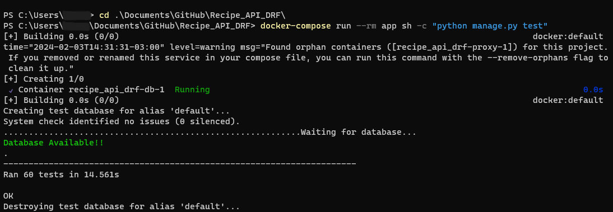

# API: Receitas Favoritas

API desenvolvida para guardar suas receitas e poder consultar quando precisar através de filtros


Se você sempre vê uma receita e pensa que deveria salvar ela para fazer depois,
acredite, está no lugar certo. Através do Endpoint de criar uma receita, você vai poder criar, editar, excluir ou consultar uma receita pela tag dela…
Gostaria de salvar receita com imagem? Sem problemas, salva uma receita e depois acrescente uma imagem nela através do endpoint que fornece essa função.

Fique tranquilo aqui no nosso sistema você não ser a "vergonha da profisoon"...


Não é uma pegadinha nosso sistema esta devidamente testado para você.



<br/>

## 🛠️ Setup A.P.I

Este projeto utiliza tecnologias listadas no requirements.txt para produção.

### Tecnologias principais
- DjangoREST: Framework web utlizado no desenvolvimento.
- uWSGI: Servidor Web que atua como interface entre Django e o servidor HTTP.
- Swagger: Utlizando documentação do swagger com lib drf_spetacular.
- AWS: Projeto hospedado na AWS para garantir escalabilidade e segurança.
- Docker: Para garantir consistencia do ambiente de desenvolvimento e produção.
- PostgreSQL: Utilizado como banco de dados relacional para armazenar os dados.
- Nginx: Atuando como servidor web reverso para gerenciar trafego e encaminha-lo para aplicação Django.

## ⏳ Executando o projeto
O projeto está dockerizado, facilitando a configuração do ambiente. Para iniciar, basta executar o seguinte comando:
```docker-compose up -d```

## 📡 Tecnologias utilizadas
<div align="center">


</div>

## Docuemntação OpenAPI

Você pode acessar a API para conferir a documentação do swagger no endereço abaixo:

http://ec2-34-229-180-18.compute-1.amazonaws.com/api/docs/

## 🔎 Status do Projeto


<br/>

